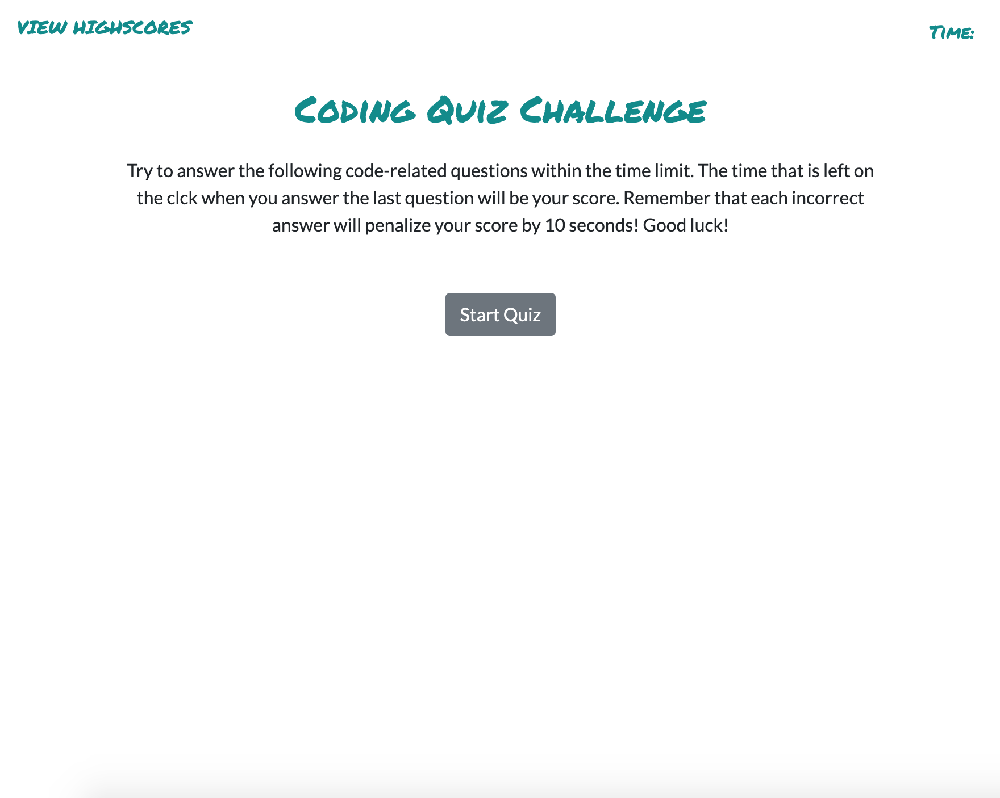
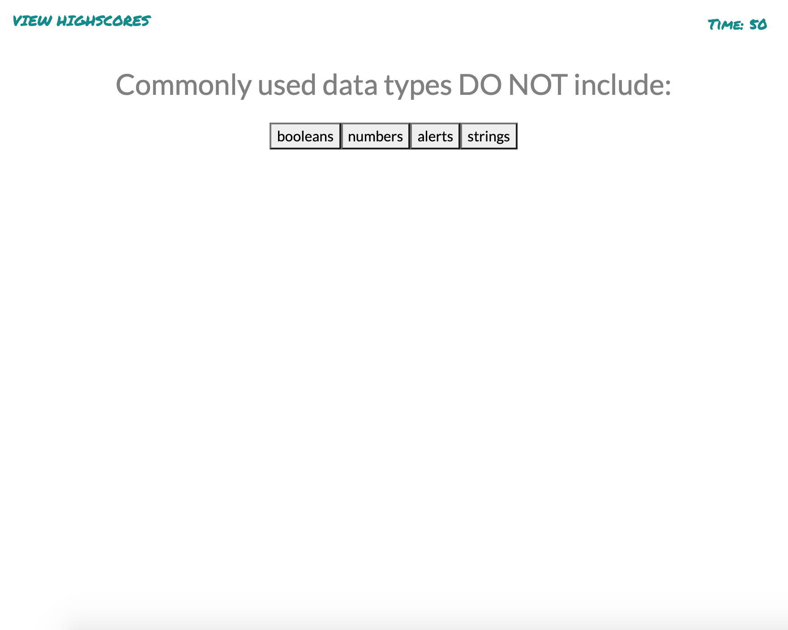

# Unit 04 Homework: Web API Code Quiz

## User Story

```
AS A coding boot camp student
I WANT to take a timed quiz on JavaScript fundamentals that stores high scores
SO THAT I can gauge my progress compared to my peers
```

## Description

I was tasked with creating a timed coding quiz with multiple choice questions. Utilizing HTML, CSS, and Javascript, the quiz asks five multiple choice questions, subtracting ten seconds from the timer when an incorrect answer is chosen. Users will then be prompted to enter their initals to save the score.

## Deployed Website

https://kelseyeckelberry.github.io/04_web_api_code_quiz/

## Screenshots



